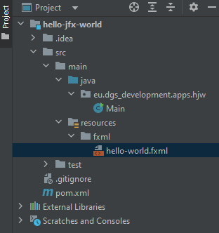
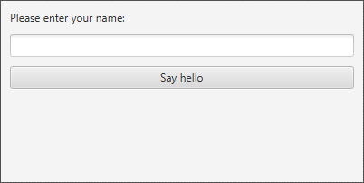
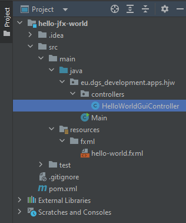
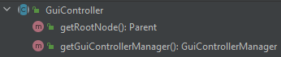
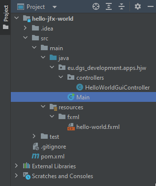

# Getting started 🚀

The following sections explain how to use this library in your project.

## 1. Download the latest version

Download the latest version of this library, which is always displayed in the README file of the project repository. 
This ensures that you have the latest features.

## 2. Create a FXML file

First of all, an FXML file must be created, which contains all controls.

All FXML-files must be placed in the "resources"-directory of your Java-project. This ensures that all files can be 
accessed and loaded at runtime.

In the following example the file "hello-world.fxml" is created, which includes some controls to interact with. It is 
recommended to create a dedicated FXML-directory inside the "resources"-directory.



It is necessary to assign unique IDs to all controls, which should be accessible from the GuiController implementation 
(as described in the next section). It is also important **not** to specify any controller-class inside the FXML file.

Content of the file "hello-world.fxml":

```xml
<?xml version="1.0" encoding="UTF-8"?>

<?import javafx.geometry.*?>
<?import javafx.scene.control.*?>
<?import javafx.scene.layout.*?>


<VBox prefHeight="200.0" prefWidth="400.0" spacing="10.0" xmlns="http://javafx.com/javafx/17.0.2-ea" xmlns:fx="http://javafx.com/fxml/1">
   <children>
      <Label text="Please enter your name:" />
      <TextField fx:id="txtUserName" />
      <Button fx:id="btnSayHello" maxWidth="1.7976931348623157E308" mnemonicParsing="false" text="Say hello" VBox.vgrow="ALWAYS" />
   </children>
   <padding>
      <Insets bottom="10.0" left="10.0" right="10.0" top="10.0" />
   </padding>
</VBox>
```

Rendered GUI:



## 3. Create a GuiController

You have to create a GuiController-class to connect a FXML-file with your source code. It is recommended to create a 
dedicated "controllers"-package inside the root-package of your project.

In this example the file "HelloWorldGuiController.java" is created:



You have to extend custom controller-classes from the abstract class "GuiController". After that you are 
forced to implement all abstract functions (including "onInitialized", "isCacheableGuiController" and "getFxmlPath").

Content of the file "HelloWorldGuiController.java":

```java
package eu.dgs_development.apps.hjw.controllers;

import eu.dgs_development.code.ejg.controllers.GuiController;
import javafx.fxml.FXML;
import javafx.scene.control.Alert;
import javafx.scene.control.Button;
import javafx.scene.control.TextField;

public class HelloWorldGuiController extends GuiController {
    @FXML
    private TextField txtUserName;

    @FXML
    private Button btnSayHello;

    @Override
    public void onInitialized() {
        //This function is called when this GuiController-instance is ready to use.
        //You can compare this function call to a constructor call.

        //You should NEVER perform any initialization logic before this function was
        //called.

        //We implement the interaction logic here, in order to greet the user.
        btnSayHello.setOnMouseClicked(event -> {
            Alert alert = new Alert(Alert.AlertType.INFORMATION);

            alert.setTitle("Hello " + txtUserName.getText() + "!");

            alert.setContentText("Nice to meet you " +
                    txtUserName.getText() + "!");

            alert.show();
        });
    }

    @Override
    public boolean isCacheableGuiController() {
        //Returns "true", if this GuiController-instance should be cached.
        //You have to create instances manually, if "false" is returned.

        //It is recommended to make all GuiController-implementations cacheable 
        //which should be reused multiple times (e.g. the main-menu of your application).
        //It is also recommended to make all cacheable GuiControllers resettable, if the 
        //controller is used multiple times (e.g. by implementing an interface with a reset-function).

        //Read about the "lifecycle" of GuiControllers for more information.
        
        return true;
    }

    @Override
    public String getFxmlPath() {
        //Enter the path to the FXML file here.
        return "/fxml/hello-world.fxml";
    }
}
```

Note that all GuiController-instances have access to the following functions, including the "GuiControllerManager" 
(see the next section for more information). This allows you to access all created GuiController-instances from every 
GuiController-instance.



## 4. Configure the GuiControllerManager

The most important component of this library is the "GuiControllerManager", which manages all available 
GuiController-instances in your project.

In this example the GuiControllerManager is created inside the file "Main.java".



It is necessary to configure the GuiControllerManager by using the helper-class "GuiConfiguration". It is always 
required to set the primary stage. All other configuration-settings are optional. They can be set through the 
setter-functions of the GuiConfiguration-instance.

Note that it is possible to catch two controller-related exceptions. The "DependencyInjectionException" is thrown, if a 
controller dependency couldn't be resolved. The "ControllerInitializationException" is thrown, if an initialization 
related error occurs (e.g. if an FXML related error occurs).

Content of the file "Main.java":

```java
package eu.dgs_development.apps.hjw;

import eu.dgs_development.apps.hjw.controllers.HelloWorldGuiController;
import eu.dgs_development.code.ejg.controllers.ControllerInitializationException;
import eu.dgs_development.code.ejg.controllers.DependencyInjectionException;
import eu.dgs_development.code.ejg.controllers.GuiConfiguration;
import eu.dgs_development.code.ejg.controllers.GuiControllerManager;
import javafx.application.Application;
import javafx.scene.Scene;
import javafx.stage.Stage;

public class Main extends Application {
    public static void main(String[] args) {
        launch(); //Launch the actual JavaFX application.
    }

    @Override
    public void start(Stage primaryStage) throws DependencyInjectionException, ControllerInitializationException {
        //Configuration of the GuiControllerManager.

        //We create a GuiConfiguration-instance with default-settings.
        GuiConfiguration guiConfiguration = new GuiConfiguration(primaryStage);
        
        //It is recommended to set the package-scan-path to avoid unnecessary reflection-lookups.
        //Note that ALL GuiController-related classes must be found in the specified package or a sub-package (this 
        //includes GuiController-implementations and dependency-injection related functions (see "dependency-injection" 
        //for more information)).
        guiConfiguration.setPackageScanPath("eu.dgs_development.apps.hjw");

        GuiControllerManager guiControllerManager = new GuiControllerManager(guiConfiguration);

        //Show the scene of the HelloWorldGuiController-instance.
        
        //It is possible to read the cached scene of this controller, because "isCacheableGuiController" 
        //returns "true".
        Scene helloWorldScene = guiControllerManager.getCachedSceneOrNull(HelloWorldGuiController.class);
        
        primaryStage.setScene(helloWorldScene);
        primaryStage.show();
    }
}
```