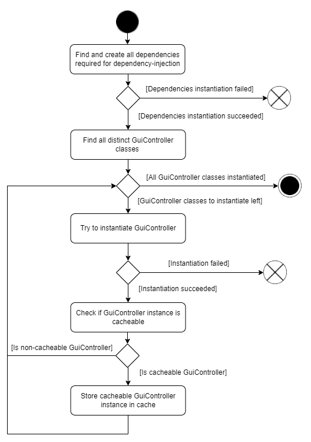
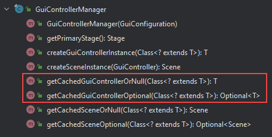
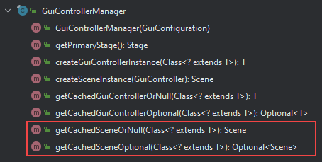
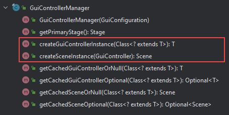

# Lifecycle 🔁

## Creation of GuiController instances

### 1. Initial creation of GuiController instances

The GuiControllerManager is responsible for creating new GuiController-instances. There are two ways for a user to 
obtain GuiController-instances. Either through a caching-mechanism or manually by creating instances just-in-time. 

The following diagram shows how GuiController-instances get created:

When a new GuiControllerManager-instance is created, it automatically looks for all available GuiController-classes, 
located at the given package-scan-path. The scan-path is specified by the user and points to the package, which contains 
all available GuiController-implementations and dependency-injection-functions (see "dependency-injection" for more 
information). If no scan-path is provided, all packages in the classpath get scanned.

After the GuiControllerManager has found all available GuiController-implementations, an instance is created for each 
found GuiController-class. Dependencies required for the instantiation are provided via the dependency-injection 
mechanism (see "dependency-injection" for more information). After each GuiController-instantiation it is checked 
whether the GuiController is a cacheable or a non-cacheable GuiController. To do this, the GuiController-function 
"isCacheableGuiController" is called. If a GuiController is a cacheable GuiController, then the object-reference is kept 
in the GuiControllerManager-cache. Otherwise, the object-reference isn't held and the garbage-collector is able to 
remove the created instance.

The reason for instantiating every found GuiController-class is to ensure that each instantiation succeeds. 
Instantiation errors should always be detectable **before** any GuiController instance is accessed for the first time.
It is possible to mark all GuiController-implementations as cacheable GuiControllers to always keep all created 
instances.

### 2. Obtaining cacheable or non-cacheable GuiController instances

It is possible to obtain GuiController-instances through the following functions (note that "T" extends from the class 
GuiController).

Cacheable GuiController-instances can be obtained by using the following functions:

It is also possible to get a cached Scene-instance for each cacheable GuiController-instance, by using the following 
functions: 

Non-cacheable GuiController-instances (or Scene-instances) must be created just-in-time by using the following 
functions:

The newly created object-instances doesn't get cached and may be removed by the garbage-collector, if no reference is 
kept.